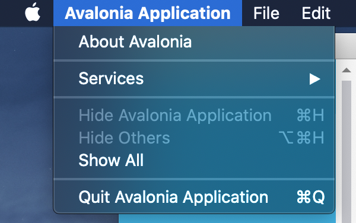

Avalonia has support for displaying operating-system integrated menus on platforms that support them, such as OSX.

## Application Menus

To display the default OS-integrated application menu add the following to your Application XAML:

```xml
<Application xmlns="https://github.com/avaloniaui"
             xmlns:x="http://schemas.microsoft.com/winfx/2006/xaml"
             x:Class="AvaloniaApplication1.App">
  <!-- Declare an empty NativeMenu to display a default menu -->
  <NativeMenu.Menu>
    <NativeMenu/>
  </NativeMenu.Menu>
</Application>
```



If you want to customize the application menu, then you can do so by declaring extra `NativeMenuItem`s in the Application XAML:

```xml
<Application xmlns="https://github.com/avaloniaui"
             xmlns:x="http://schemas.microsoft.com/winfx/2006/xaml"
             x:Class="AvaloniaApplication1.App">
  <NativeMenu.Menu>
    <NativeMenu>
      <NativeMenuItem Header="About MyApp" Click="About_Click"/>
    </NativeMenu>
  </NativeMenu.Menu>
</Application>
```

And add a standard event handler to `Application.cs` for the `Click` event:

```csharp
private void About_Click(object sender, EventArgs e)
{
    // Logic for handling click here.
}
```

## Window Menus

Native menus can also be added to a window. In addition, adding a `NativeMenuBar` to the window means that the window menus will be displayed as a standard Avalonia menu on platforms that do not support OS-integrated menus such as Windows:

```xml
<Window xmlns="https://github.com/avaloniaui"
        xmlns:x="http://schemas.microsoft.com/winfx/2006/xaml"
        x:Class="AvaloniaApplication1.MainWindow">

  <NativeMenu.Menu>
    <NativeMenu>
      <NativeMenuItem Header="File">
        <NativeMenuItem.Menu>
          <NativeMenu>
            <NativeMenuItem Header="Open"/>
          </NativeMenu>
        </NativeMenuItem.Menu>
      </NativeMenuItem>
      <NativeMenuItem Header="Edit">
        <NativeMenuItem.Menu>
          <NativeMenu>
            <NativeMenuItem Header="Copy"/>
            <NativeMenuItem Header="Paste"/>
          </NativeMenu>
        </NativeMenuItem.Menu>
      </NativeMenuItem>
    </NativeMenu>
  </NativeMenu.Menu>

  <DockPanel>
    <NativeMenuBar DockPanel.Dock="Top"/>
    <TextBlock>
      Window content here.
    </TextBlock>
  </DockPanel>

</Window>
```

## Commands

You can also use the standard command pattern with native menus, binding them to commands on the `Application.DataContext`
or `Window.DataContext`:

```xml
<Application>
  <NativeMenu.Menu>
    <NativeMenu>
      <NativeMenuItem Header="About MyApp" Command="{Binding AboutCommand}" />
    </NativeMenu>
  </NativeMenu.Menu>
</Application>
```
