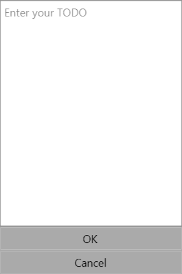
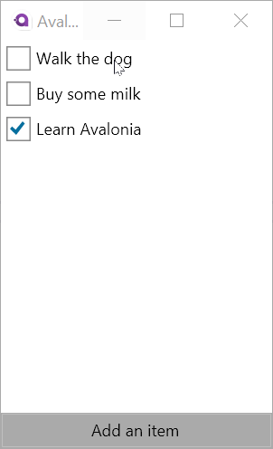

When we originally created the `TodoListView` we added an "Add an item" button. It's time now to
make that button do something. When the button is clicked we want to replace the list of items with
a new view which will allow the user to enter the description of a new item.

## Create the view

We start by creating the view
(see [here](/docs/tutorial/creating-a-view#create-the-usercontrol)
for a refresher on how to create a `UserControl` using a template):

:::filename
Views/AddItemView.axaml
:::
```xml
<UserControl xmlns="https://github.com/avaloniaui"
             xmlns:x="http://schemas.microsoft.com/winfx/2006/xaml"
             xmlns:d="http://schemas.microsoft.com/expression/blend/2008"
             xmlns:mc="http://schemas.openxmlformats.org/markup-compatibility/2006"
             mc:Ignorable="d" d:DesignWidth="200" d:DesignHeight="300"
             x:Class="Todo.Views.AddItemView">
  <DockPanel>
    <Button DockPanel.Dock="Bottom">Cancel</Button>
    <Button DockPanel.Dock="Bottom">OK</Button>
    <TextBox AcceptsReturn="True"
             Text="{Binding Description}"
             Watermark="Enter your TODO"/>
  </DockPanel>
</UserControl>
```

This gives us a view which looks like this:



The only new thing here is the `<TextBox>` control which is a control that allows a user to input
text. We set three properties on it:

- `AcceptsReturn` creates a multi-line `TextBox`
- `Text` binds the text that is displayed in the `TextBox` to the `Description` property on the
  view model
- `Watermark` causes a placeholder to be displayed when the `TextBox` is empty

## Create the view model

Our view model is going to start out _extremely_ simple. We're just going to provide the
`Description` property that the `TextBox` is bound to for starters. We'll add to this as we go
along.

:::filename
ViewModels\AddItemViewModel.cs
:::
```csharp
namespace Todo.ViewModels
{
    class AddItemViewModel : ViewModelBase
    {
        public string Description { get; set; }
    }
}
```

## Swap out the list view model

When we click the "Add an item" button, we want to stop showing the `TodoListView` in the window
and show the `AddItemView`. We can alter the `MainWindowViewModel` to let us do this:

:::filename
ViewModels/MainWindowViewModel.cs
:::
```csharp
using ReactiveUI;
using Todo.Services;

namespace Todo.ViewModels
{
    class MainWindowViewModel : ViewModelBase
    {
        ViewModelBase content;

        public MainWindowViewModel(Database db)
        {
            Content = List = new TodoListViewModel(db.GetItems());
        }

        public ViewModelBase Content
        {
            get => content;
            private set => this.RaiseAndSetIfChanged(ref content, value);
        }

        public TodoListViewModel List { get; }

        public void AddItem()
        {
            Content = new AddItemViewModel();
        }
    }
}

```

Here we add a `Content` property which is initially set to our list view model. When the `AddItem()`
method is called, we assign an `AddItemViewModel` to the `Content` property.

The `Content` property setter calls `RaiseAndSetIfChanged` which will cause 
[a change notification](/docs/binding/change-notifications) to be fired each time the property
changes value. Avalonia's binding system needs change notifications in order to know when to update
the user-interface in response to a property change.

We now want to bind our `Window.Content` property to this new `Content` property instead of the
`List` property that it is currently bound to:

:::filename
Views/MainWindow.axaml
:::
```xml{7}
<Window xmlns="https://github.com/avaloniaui"
        xmlns:x="http://schemas.microsoft.com/winfx/2006/xaml"
        x:Class="Todo.Views.MainWindow"
        Icon="/Assets/avalonia-logo.ico"
        Width="200" Height="300"
        Title="Avalonia Todo"
        Content="{Binding Content}">
</Window>
```

And finally we need to make the "Add an item" button call `MainWindowViewModel.AddItem()`.

:::filename
Views/TodoListView.axaml
:::
```xml{9}
<UserControl xmlns="https://github.com/avaloniaui"
             xmlns:x="http://schemas.microsoft.com/winfx/2006/xaml"
             xmlns:d="http://schemas.microsoft.com/expression/blend/2008"
             xmlns:mc="http://schemas.openxmlformats.org/markup-compatibility/2006"
             mc:Ignorable="d" d:DesignWidth="200" d:DesignHeight="300"
             x:Class="Todo.Views.TodoListView">
  <DockPanel>
    <Button DockPanel.Dock="Bottom"
            Command="{Binding $parent[Window].DataContext.AddItem}">
      Add an item
    </Button>
    <ItemsControl Items="{Binding Items}">
      <ItemsControl.ItemTemplate>
        <DataTemplate>
          <CheckBox Margin="4"
                    IsChecked="{Binding IsChecked}"
                    Content="{Binding Description}"/>
        </DataTemplate>
      </ItemsControl.ItemTemplate>
    </ItemsControl>
  </DockPanel>
</UserControl>
```

The binding we've added to `<Button>` is:

```xml
Command="{Binding $parent[Window].DataContext.AddItem}"
```

There are a few parts to this:

- The `Button.Command` property describes a command to be called when the button is clicked
- We're binding it to `$parent[Window].DataContext.AddItem`:
  - `$parent[Window]` means find an ancestor control of type `Window`
  - And get its `DataContext` (i.e. a `MainWindowViewModel` in this case)
  - And bind to the `AddItem` method on that view model

This will cause the `MainWindowViewModel.AddItem()` method to be invoked when the button is 
clicked.

:::note
If you're familiar with WPF or UWP you may think it strange that we're binding `Button.Command` to
a method. This is a convenience feature of Avalonia which means that you don't have to create an
`ICommand` for simple commands that are always enabled.
:::

## Run the application

If you now run the application and click the "Add an item" button you should see the new view appear.



<a class="btn btn-primary" role="button" href="adding-new-items-2">
    Next
</a>
