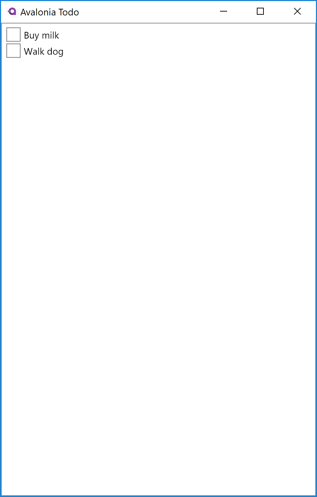

Title: Displaying the list
Order: 40
---

To display the list we'll need a view. Add an Avalonia `UserControl` to the `Views` directory called `TodoListView` by following these steps:

- In **Visual Studio** right click the `Views` folder, and select "Add" -> "New Item" -> "Avalonia" -> "User Control" and give the control the name `TodoListView`
- In **.NET core** run this command from directory that contains the `Views` directory:

```powershell
dotnet new avalonia.usercontrol -o Views -n TodoListView
```

Edit the `TodoListView.xaml` file to have the following content:

 `Views/TodoListView.xaml`:
 ```xml
 <UserControl xmlns="https://github.com/avaloniaui"
              xmlns:x="http://schemas.microsoft.com/winfx/2006/xaml">
  <ItemsControl Items="{Binding Items}">
    <ItemsControl.ItemTemplate>
      <DataTemplate>
        <CheckBox IsChecked="{Binding IsChecked}" Content="{Binding Description}"/>
      </DataTemplate>
    </ItemsControl.ItemTemplate>
  </ItemsControl>
</UserControl>
 ```

In this view, we're displaying an [`ItemsControl`](/controls/itemscontrol) which has its `Items` property bound to the `TodoListViewModel.Items` property. The `ItemsControl` can is a very simple control which simply displays each item in the collection assigned to its `Items` property. Here each item will each be of type `TodoItemViewModel` as that's what `TodoListViewModel.Items` exposes.

> How do we know that we're binding to a `TodoListViewModel` in `TodoListView`? Because Avalonia will handle this for us by setting the [`DataContext`](/docs/binding/datacontext). As long as you're not doing anything funky you can assume that the bindings in a view will be against the related view model. 

How each item is displayed is controlled by the `ItemTemplate`: in this case we display each item as a `CheckBox`, with the check state bound to the `IsChecked` property of the `TodoItemViewModel` and the content bound to the `Description`.

> You'll notice here that the `CheckBox` is no longer binding to a `TodoListViewModel`, it's binding to a `TodoItemViewModel`. This is because the `ItemsControl` automatically sets the [`DataContext`](/docs/binding/datacontext) of each item to the view model that it represents.

We now need to update the `MainWindowViewModel` to display the list.

`ViewModels/MainWindowViewModel.cs`:
```csharp
using ReactiveUI;
using Todo.Services;

namespace Todo.ViewModels
{
    public class MainWindowViewModel : ViewModelBase
    {
        object content;

        public MainWindowViewModel()
        {
            var database = new Database();
            var items = database.GetItems();
            Content = new TodoListViewModel(items);
        }

        public object Content
        {
            get => content;
            private set => this.RaiseAndSetIfChanged(ref content, value);
        }
    }
}
```

Here we've added a `Content` property to the `MainWindowViewModel` which will expose the active view model. In the constructor we then create a `TodoListViewModel` with the items read from the "database" and assign this to `Content`.

Finally we need to edit `MainWindow.xaml` to display the content:

`Views/MainWindow.xaml`:
```xml
<Window xmlns="https://github.com/avaloniaui"
        xmlns:x="http://schemas.microsoft.com/winfx/2006/xaml"
        xmlns:vm="clr-namespace:Todo.ViewModels;assembly=Todo"
        Icon="resm:Todo.Assets.avalonia-logo.ico"
        Title="Avalonia Todo" Width="400" Height="600"
        Content="{Binding Content}">
</Window>
```

The important line here is `Content="{Binding Content}"`: we're binding the window content to `MainWindowViewModel.Content.`

If you now run the application you should see each TODO item displayed as a `CheckBox`:

