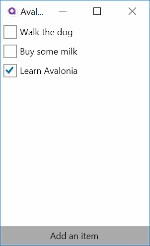

Title: Tutorial
Order: 0
---
In this tutorial we're going to be creating a simple TODO application in Avalonia using the Model-View-ViewModel (MVVM) pattern.

The finished application will look like this:

You can find the code for the completed application [here](https://github.com/grokys/todo-tutorial). 

## Model-View-ViewModel (MVVM)

We're going to be using the [Model-View-ViewModel pattern (MVVM)](/docs/quickstart/mvvm) for this tutorial. MVVM is a common pattern used for writing GUI applications, and is the recommended pattern to use when writing Avalonia applications. We'll be assuming a [CRUD](https://en.wikipedia.org/wiki/Create,_read,_update_and_delete) application here, but most of
these concepts can be applied to all types of applications.

:::note
For this guide we're going to be using [ReactiveUI](https://reactiveui.net/) which is a MVVM framework based on [.NET Reactive Extensions](http://reactivex.io/). This guide will explain how to use MVVM and ReactiveUI with Avalonia but you can also see the [ReactiveUI documentation](https://reactiveui.net/docs/) for more detailed information.
:::

<a class="btn btn-primary" role="button" href="creating-the-project">
    Get started
</a>